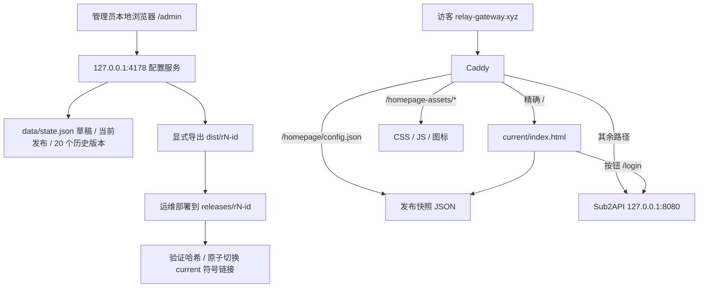

# Caddy 静态首页详细设计与开发计划

2026-10-01 · v1.0 · 已选择 Caddy 静态方案；本稿取代早期文档中动态 PublicPageAdapter 作为本期必需条件的结论。

## 目标和交付边界

首页、配置编辑器、发布存储、静态导出和部署材料统一保存在 `E:\ai\dev\sub2api-homepage`。生产访问首页根路径，登录/注册/控制台/网关 API 沿用 Sub2API。此次开发完成后先供用户本地验收；生产访问授权仍是只读，部署是单独操作。

复用此前首页蓝青色视觉、Hero、接口地址、模型标签、能力卡片和公告弹窗。访客页面所有内容由发布配置驱动；管理员控件不出现在访客首页。

## 已核实事实与本次纠正

2026-09-30 的生产核查记录表明：Caddy 整域反代 `127.0.0.1:8080`，容器镜像 `relaygateway:v0.2.5`。`/api/v1/settings/public`、`/api/v1/model-plaza` 可匿名访问，响应格式为 `{code:0,message:"success",data:{...}}`。这些是核查时状态，未宣称之后未变化。

2026-10-01 本地代码复查发现 `manifest.schema.json` 对 capability 使用固定值 `openai.oauth.outbound_transport.v1`，没有普通首页/配置能力。因此当前不能把普通首页打包成可直接安装的 `.s2plugin`，也不能假装声明 `ui/public_page` 就能通过安装。首期实现独立配置工作台，预留 UI Bridge 契约，待通用配置插件能力确认后再对接。

Caddy 精确路径应该使用 `@homepage path /` 和 `handle @homepage`。早期文档中的 `handle =/` 有误，请以本工程的 `deploy/Caddyfile.example` 为准。

## 架构

首页上线后 Node 服务不参与访客请求链路。发布修改和 Caddy 文件激活是两个动作：本地发布 ≠ 生产部署。

## 模块与实现

| 模块 | 实现位置 | 职责 |
|---|---|---|
| 配置边界 | `public/homepage-assets/contract.mjs` | 类型、未知字段、链接、长度、时间、ID 校验；公开投影 |
| 状态存储 | `lib/store.mjs` | 草稿 revision 乐观锁；临时文件 fsync + rename；更新成功后再切内存状态 |
| 工作台 API | `tools/server.mjs` | 本机 Host、Origin、JSON 类型限制；配置 API；匿名源 fixture/live 适配 |
| 访客前端 | `public/index.html`、`home.mjs` | GET 发布快照、安全 DOM 渲染、模型筛选搜索、公告、复制、错误空态 |
| 管理前端 | `admin/` | 所有模块表单，增删排序、草稿预览、保存、发布、历史恢复、导出 |
| 静态导出 | `tools/export.mjs` | 仅复制访客 allowlist，输出版本目录和 SHA-256 清单 |
| 发布切换 | `deploy/activate-release.py` | 默认只校验；显式 --activate 原子切换 current，支持指向旧版本回滚 |

## 配置规则

1. 配置字段为 snake_case，版本 `schema_version=1`，完整 schema 行为以校验器为准。
2. 品牌、Hero、菜单、按钮、API、模型、能力、公告、页脚均为必需对象/数组，开关控制是否展示。
3. 数组顺序即展示顺序；ID 唯一；条目停用后不进入导出的公开数组。
4. 地址默认来自发布快照；可开启 `runtime.system_settings`，同源读取系统品牌、API 地址和注册开关。失败保留发布值。
5. 首页不自动抓整份模型广场。管理员主动载入匿名候选，保留非专属分组模型名称，手动指定能力类别、选择后发布。候选没有密钥、用户身份或组价格。
6. 公告首期独立纯文本配置，不复用用户定向公告。支持起止 ISO 时间、popup/banner/silent、visit/daily/once；浏览器关闭键包含公告 ID+version。
7. 文案通过 `textContent` 渲染，不支持可执行 HTML。链接仅安全站内路径、锚点、无凭据 HTTPS；考虑 QQ 旧版加群链接，HTTP 仅允许 `qm.qq.com`、`qun.qq.com`、`jq.qq.com`、`shang.qq.com` 四个官方域名；Logo 仅包内 `/homepage-assets/`。
8. 静态配置失败时隐藏模型/API/公告，保留可用登录入口；不从草稿或浏览器配置取回退。

## 存储与发布

内部状态：`{schema_version,draft_revision,draft,published,history}`。公开状态：`{schema_version,revision,published_at,config}`。

保存校验 expected_revision 后递增草稿版本，发布将旧快照存入历史并生成递增发布版本。恢复历史只写草稿，正式发布再生成新版本。Node 同一进程同步提交串行化；这是单机单写者设计，不支持多个配置服务进程同时写同一文件。历史最多 20 个，导出包需运维单独保留，磁盘长期保留策略由部署方案管理。

导出目录不可覆盖且 ID 唯一。SHA 清单检测传输损坏，不等于发布签名；上线需信任审核后的本机产物。Caddy 只提供三个指定路径，未声明资源/管理配置路径继续交原 Sub2API。Caddy 的现有 SSE 排除、HTTPS、安全响应头和日志应保留。

## 前端联调顺序

1. 离线 fixture 验证页面和编辑发布闭环，不依赖线上。
2. `--live-public` 模式只读生产两个公开 GET 接口；失败不改已发布版本。
3. 本地 `/login` 302 至真实线上 `/login`；生产同域原样反代，登录仍由 Sub2API 完成。
4. `npm run build` 导出并本地静态 HTTP 核对资源和配置。
5. 用户验收后再安排 Caddy 文件激活，先验证新目录和路径，保留旧 Caddy 配置/释放目录回滚。

## 开发计划与状态

| 阶段 | 内容 | 本次状态 |
|---|---|---|
| P0 | 收敛静态架构，核对 SPA 路由/清单限制 | 完成 |
| P1 | 配置校验、草稿/发布/历史/导出、接口测试 | 完成 |
| P2 | 静态首页和本地配置工作台 | 完成 |
| P3 | 桌面/移动浏览器验证、Caddy 材料、运行说明 | 见测试记录 |
| P4 | 生产静态部署 | 待用户测试后独立安排，未执行 |
| P5 | Sub2API 通用配置插件 / UI Bridge 安装 | 底座现有清单不支持，契约已记录 |

## 插件后续接入

在当前底座支持“纯配置插件”之前，不能伪装成 OAuth 传输插件安装，以免绑定网关能力。后续建议新增配置插件 capability 与配置验证生命周期，不增加访客动态公开 API。配置 UI 通过 `config.load/save` 保存完整草稿/发布文档；静态发布由部署机受控导出作业完成。浏览器 UI 不能获取 SSH 私钥、管理员密码或执行远程发布。必须具备 exporter 的持久文件路径/宿主受控发布端口后，才能实现后台按钮自动同步静态内容。
